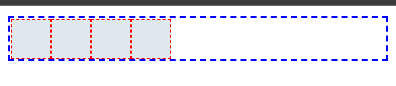
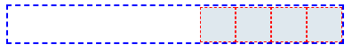
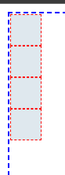
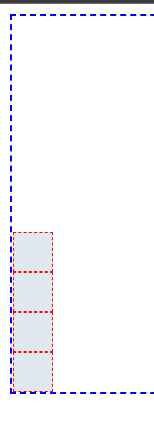
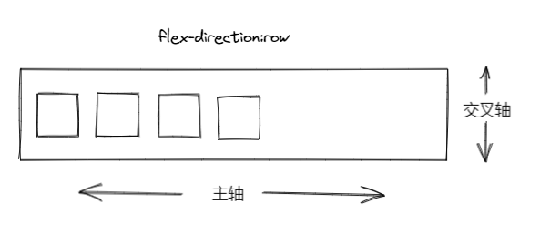
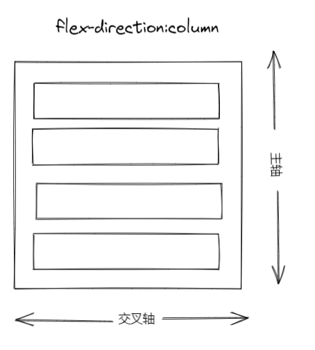
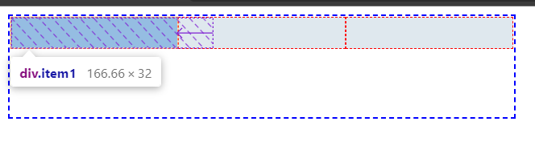
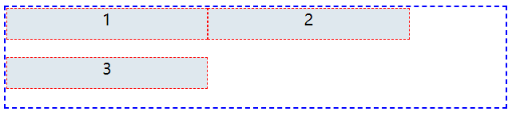
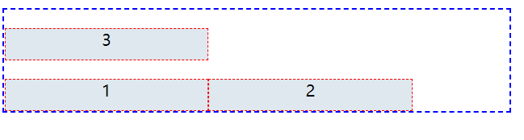
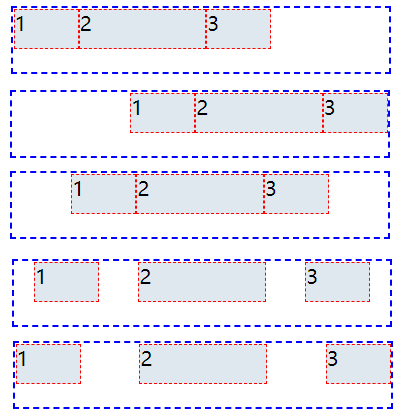

flex布局可以说是学css必学的布局，因为它的功能强大，是使用响应式布局设计网页的重要布局方式。
<!-- more -->
# 弹性布局

> 本文806字，阅读大概需要3分20秒

## 简介

Flex布局于2009由W3C提出，用于响应式地实现网页的布局。现在是市面上比较常见的布局方式。

## 什么是Flex布局

> Flexible Box 模型，通常被称为 flexbox，是一种一维的布局模型。它给 flexbox 的子元素之间提供了强大的空间分布和对齐能力。本文给出了 flexbox 的主要特性

也就是你的父元素是flex布局，那么你的子元素就可以实现自动对齐、居中、空间排列等，可以方便我们在调整元素排列的一种布局。

```css
/*这个是父元素*/
.box{
    display:flex
}
```

### Flex的两条轴

 横轴的和竖轴，也可称为主轴和交叉轴。主轴是子元素的排列方向由 `  flex-direction ` 属性定义：

> 这个属性用于父元素

:::: code-group

::: code-group-item HTML

```html	
<body>
    <div class="box">
        <div class="item1"></div>
        <div class="item2"></div>
        <div class="item3"></div>
        <div class="item4"></div>
    </div>
</body>
```

:::

::: code-group-item Style

```css	
<style>
    .box{
        display: flex;
        width: 300px;
        border: blue dashed 2px;
    }
    .box div{
        width: 30px;
        height: 30px;
        background-color: #dfe8ee;
        border: 1px red dashed ;
    }
</style>
```

:::

::::

*  flex-direction:row  (横向，正序)

  

* row-reverse（横向，逆序）

  

* column（竖向，正序）

  

* column-reverse（竖向，逆序）

  

交叉轴也就是于主轴交叉的轴了，拿当flex-direction:row，也就是子元素为横向排布时讲，这时的主轴和交叉轴就是如下



flex-direction:column时，主轴和交叉轴如下



## flex-wrap 多行容器

> 这个属性用于父元素,默认值为:nowrap

子元素的是否换行排列由`flex-wrap`属性决定,当一列的子元素大于父元素的宽度时,父元素设置为` flex-wrap: wrap` ,可以让子元素往下沉淀.如果是设置为`flex-wrap: nowrap` 那么子元素的宽度会受到父元素宽度的约束,即使是在说明了子元素宽度的情况下.

```css
 .box{
        display: flex;
        width: 500px;
        height: 100px;
        border: blue dashed 2px;
        flex-direction:row;
        flex-wrap: nowrap;
    }
    .box div{
        width: 200px;
        height: 30px;
        background-color: #dfe8ee;
        border: 1px red dashed ;
    }
```



可以看到每一个子元素宽度都没达到200px,是flex布局自动适应了父元素的宽度.

```css
flex-wrap: wrap;
```



子元素自动换行,而且宽度能达到200px

```css
 flex-wrap: wrap-reverse;
```



 换行，第一行在下方。 

## flex-flow

> 这属性用于父元素,默认值为`row nowrap`。 

 `flex-flow`属性是`flex-direction`属性和`flex-wrap`属性的简写形式，

##  justify-content属性

> 这属性用于父元素,默认值为`flex start`

这个属性用于定义如何分配元素在主轴上的排列和空间

```css
.box {
  justify-content: flex-start | flex-end | center | space-between |
      space-around;
}
```


- `flex-start`:左对齐
- `flex-end`：右对齐
- `center`： 居中
- `space-between`：两端对齐，项目之间的间隔都相等。
- `space-around`： 在每行上从头开始均匀分配弹性元素。相邻元素间距离相同。

## align-items属性

该属性用于子元素在交叉轴中的排列。
示例： [ align-items ](https://interactive-examples.mdn.mozilla.net/pages/css/align-items.html) 


