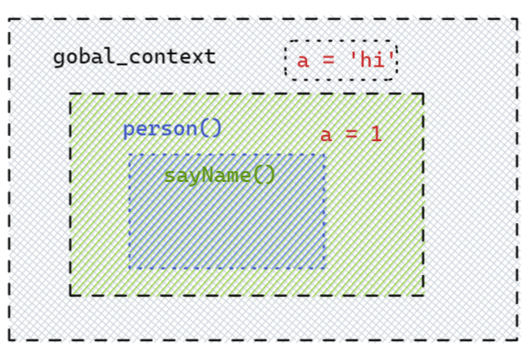

JavaScript必学进阶知识点：执行上下文，本文浅说一下执行上下文和执行栈，了解执行上下文对理解变量提升，作用域，闭包等至关重要

<!--more--->

# 执行上下文

执行上下文是一种对Javascript代码执行环境的一种抽象概念，也就是说只要有Javascript代码运行，那么它就一定是运行在执行上下文中。

## 执行上下文类型

分为三种：

- 全局执行上下文：只有一个，浏览器中的全局对象就是 `window`对象，`this` 指向这个全局对象
- 函数执行上下文：存在无数个，只有在函数被调用的时候才会被创建，每次调用函数都会创建一个新的执行上下文
- Eval 函数执行上下文： 指的是运行在 `eval` 函数中的代码，很少用而且不建议使用

**栗子**

```js
 var a = 'hi';
    function person(){
        var a = 1;
        function sayName(){
            return a
        }  
    }
```



全局上下文只有一个就是window对象，函数上下文有`person()`和`sayName()`,每创建一个函数就拥有一个新的函数上下文，私有的作用域。

## 执行栈

也称为`调用栈`，就是数据结构中的栈，先进后出，存储被创建的上下文。每当有新的函数上下文创建就会加于栈顶，当函数执行完毕，就会从栈顶抛出，调用下一个上下文，直到抛出全局上下文。

## 创建上下文

创建执行上下文有两个阶段：**创建阶段** 和 **执行阶段**。

在创建阶段会发生三件事：

1. **this** 值的决定，即我们所熟知的 **This 绑定**。
2. 创建**词法环境**组件。
3. 创建**变量环境**组件。

### this的绑定

全局上下文this指向全局对象**window**

函数this的绑定需要观察函数的执行：

* 如果是一个对象函数执行，那`this`指向那个对象
* 如果在全局中执行，则指向全局或者`undefind`(严格模式下)

### 词法环境

[ECMA-262 第 6 版](https://262.ecma-international.org/6.0/#sec-lexical-environments)中规定词法作用域是：

>*词法环境*是一种规范类型，用于根据 ECMAScript 代码的词法嵌套结构定义*标识符*与特定变量和函数的关联。词法环境由一个环境记录和一个可能对*外部*词法环境的空引用组成。

这里的标识符是变量的名字，特定变量就是实际的对象（指函数类型对象或原始数据的引用）。

* **环境记录器**
  存储变量和函数声明的实际位置。环境记录器分为**声明式环境记录器**和**对象环境记录器**分别位于`函数环境`中和`全局环境`中。作用分别是：1）存储变量、函数和参数；2）用来定义出现在**全局上下文**中的变量和函数的关系。
* **外部环境的引用**
  意味着它可以访问其父级词法环境（作用域），全局的外部引用是空

::: tip

外部环境的引用与this不同，全局上下文this指向Windows，外部环境引用是`<null>`

:::

**伪代码：**

```js
//全局执行上下文
GlobalExectionContext = {
    //全局词法环境
  LexicalEnvironment: {
      //环境记录器：对象环境记录器
    EnvironmentRecord: {
      Type: "Object",
      // 在这里绑定标识符
    }
      //外部环境的引用
    outer: <null>
  }
}
//函数执行上下文
FunctionExectionContext = {
  LexicalEnvironment: {
    EnvironmentRecord: {
        //声明式环境记录器
      Type: "Declarative",
      // 在这里绑定标识符
    }
    outer: <Global or outer function environment reference>
  }
}
```


::: details 参考文献

* [面试官：JavaScript中执行上下文和执行栈是什么？ | web前端面试 - 面试官系列 (vue3js.cn)](https://vue3js.cn/interview/JavaScript/context_stack.html#一、执行上下文)

* [理解Javascript中的执行上下文和执行栈 - 知乎 (zhihu.com)](https://zhuanlan.zhihu.com/p/107552264)

* [[译\] 理解 JavaScript 中的执行上下文和执行栈 - 掘金 (juejin.cn)](https://juejin.cn/post/6844903682283143181#heading-4)


:::

****