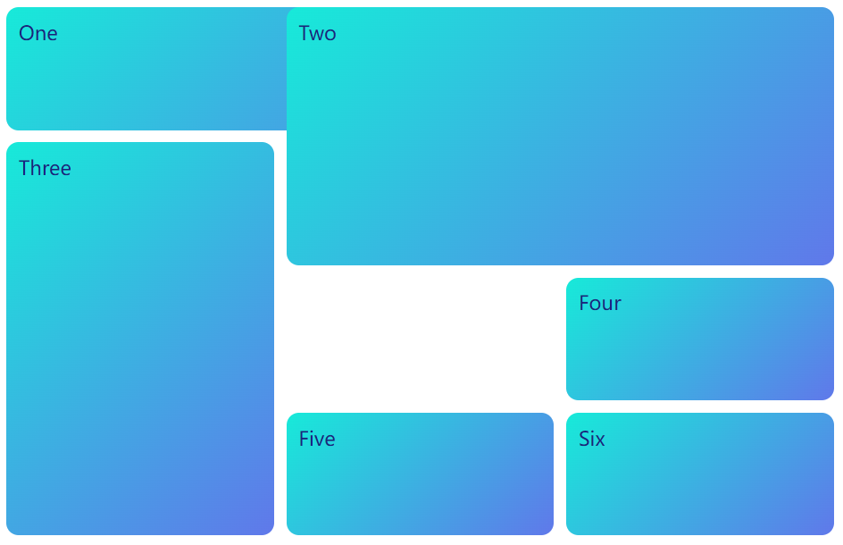
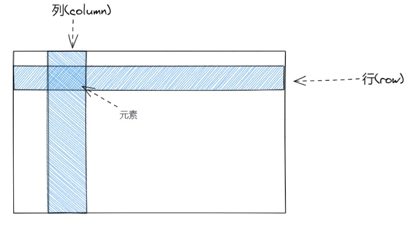

Grid布局是通过网格线进行布局，将容器分成“列”和“行”，同时也是一种自适应布局
<!-- more -->

这种布局根excel表格很像，可以自由地调节容器地行高和宽度，不过它的功能更多相比来说会更加简单。Grid布局我认为是所有布局当中最容易调试，也是很容易理解的一种。

:::: code-group
::: code-group-item HTML

```html
<div class="wrapper">
        <div class="one">One</div>
        <div class="two">Two</div>
        <div class="three">Three</div>
        <div class="four">Four</div>
        <div class="five">Five</div>
        <div class="six">Six</div>
      </div>
```

:::

::: code-group-item CSS

```css
.wrapper {
  display: grid;
  grid-template-columns: repeat(3, 1fr);
  grid-gap: 10px;
  grid-auto-rows: minmax(100px, auto);
}
.wrapper div{
    color: #1a237e;
    padding: 10px;
    border-radius: 10px;
    background: linear-gradient(135deg,#17ead9,#6078ea);
}
.one {
  grid-column: 1 / 3;
  grid-row: 1;
}
.two {
  grid-column: 2 / 4;
  grid-row: 1 / 3;
}
.three {
  grid-row: 2 / 5;
  grid-column: 1;
}
.four {
  grid-column: 3;
  grid-row: 3;
}
.five {
  grid-column: 2;
  grid-row: 4;
}
.six {
  grid-column: 3;
  grid-row: 4;
}
```

:::

::::

这些子元素都是在网格的空间内的，一个子元素就是一个格子。

## 简介

Grid的前身是谷歌推出的，要在CSS框架中使用，后来发展成了浏览器内置。

## 概念

根Flex布局，布局基于一个父容器，内包含子元素


:::: code-group

::: code-group-item HTML

```html
 <div class="container">
        <div class="item1"></div>
        <div class="item2"></div>
        <div class="item3"></div>
        <div class="item4"></div>
    </div>
```

:::

::: code-group-item CSS

```css
.container{
        display: grid;
    }
```


:::

::::
container是容器，item是项目

因为是基于表格，所以必然是通过行和列确定子项目，而一个单元格就是一个项目，`m`行`n`列就会有`m x n` 个单元格，当然并不是一个项目就一定是占一个单元格，也可以是多个



## 列宽行高

跟excel表一样，行高和列宽是可以被定义的：

* `grid-template-columns`:每一列的列宽
* `grid-template-rows`: 每一行的行高 

  

```css
.container{
        display: grid;
        grid-template-columns:100px 100px 100px;
        grid-template-row:100px 100px 100px;
    }
```

上诉的定义就是三行三列都是100px的意思。

### repeate()函数

Grid布局自带一个函数:`repeat()`，然后你就可以简介你的代码

```css
.container{
        display: grid;
        grid-template-columns:repeat(3,100px);
        grid-template-row:repeat(3,100px);
    }
```

### fr关键字
同时Grid布局为了自适应，采取了`fr` 单位,这个单位类似于`rem` 根据浏览器切换大小。

```css
.container{
        display: grid;
        grid-template-columns:repeat(1fr);
        grid-template-row:repeat(1fr);
    }
```

### auto关键字

 表示由浏览器自己决定长度 

