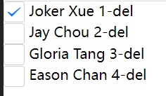
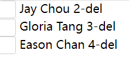

使用v-for指令，加key值往往显得多余，这个key既不可以在视图中存在，也不能在数据模型中读取，它是为了什么而使用？

<!--more-->

#  v-for中key的作用

## v-for

首先v-for指令的作用是遍历一个数组或者对象，然后生成对应数量的dom节点，并将数据渲染到视图。

**栗子**

```vue
<template>
	<view>
		<view v-for="item in stu">
			{{item.name}}
		</view>
	</view>
</template>

<script>
	export default {
		data() {
			return {
				stu:[
					{name:'Joker Xue',id:1},
					{name:'Jay Chou',id:2},
					{name:'Gloria Tang',id:3}
				]
			}
		},
		
		}
	}
</script>

<style lang="scss">
	
</style>

```

此处v-for没有使用key值，但是数据仍然能渲染到页面当中，这种情况称之为默认模式，如果更新数据默认模式将会是比较高效的。

## key值

vue官方对key值有一个很清晰的描述：[内置的特殊 Attributes - key| Vue.js (vuejs.org)](https://staging-cn.vuejs.org/api/built-in-special-attributes.html#key) 

>`key` 这个特殊的 attribute 主要作为 Vue 的虚拟 DOM 算法提示，在比较新旧节点列表时用于识别 vnode

key值作为一个遍历节点的唯一标识，用于替换DOM节点。

在没有 key 的情况下，Vue 将使用一种最小化元素移动的算法，并尽可能地就地更新/复用相同类型的元素。没有key值情况下，删除数据列中的某一个，仅会更新虚拟DOM中对应的部分，不会替换整个DOM。

如果传了 key，则将根据 key 的变化顺序来重新排列元素，并且将始终移除/销毁 key 已经不存在的元素。

传入key值用于弥补使用子组件时，数据列更新DOM没有被替换而是更新的情况。要是我们的视图中包含子组件的复用，但是从数据列中删除某一个子集然后更新视图的方式，就会有子组件的逻辑异常：当节点数目出现改动时，子组件的排列顺序与对应的父组件不一致，也就是子组件错位了。

**例子**

```vue
<template>
	<view>
		<view >
			<button @tap="add">add</button>
		</view>
		<view  v-for="(item,index) in stu" :key="item.id" >
				<checkbox />
			{{item.name}}
			<text @tap="handleDelete(index)">-del</text>
		</view>
	</view>
</template>

<script>
	export default {
		data() {
			return {
				isActive:false,
				stu:[
					{name:'Joker Xue',id:1},
					{name:'Jay Chou',id:2},
					{name:'Gloria Tang',id:3}
				]
			}
		},
		methods: {
			add(){
       let len = this.stu.length;
				this.stu.push({
                    name:'EasonChan',
                    id:this.stu[len-1].id+1
                })
			},
			handleDelete(ind){
				this.stu.splice(ind,1)
			}
		}
	}
</script>

<style lang="scss">

</style>


```

::: tip

`<checkbox />`是uniapp提供的一个复选框组件

:::

有使用key值的情况下，删除节点对应的子组件也会销毁，没有发生错位。



删除 →



没有使用key值的情况下，点击删除节点，对应的节点理应在DOM树中销毁，但实际上是位于渲染列表最后一个节点被删除，新列表
