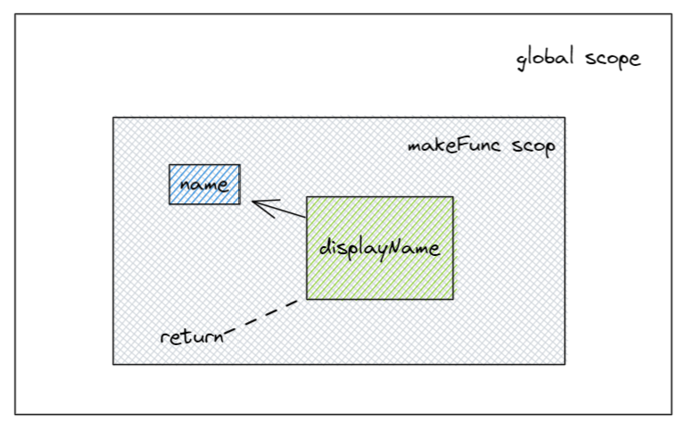

# 闭包

>本文1036字，阅读大概需要4分10秒

闭包是学习JavaScript的必经之路，因为它随处可见。闭包如同你刷牙会挤牙膏一样重要。

## 闭包是什么

闭包就是**能够读取其他函数内部变量的函数**。基于词法作用域写代码产生的结果，也就说闭包是一种特性不是只用语法或是Api。

## 词法作用域

在理解闭包之前要先知道`词法作用域`，JavaScript分为两种工作模式：一种是`词法作用域`,一种是`动态作用域`。一般普遍使用词法作用域。

词法作用域怎么理解：`词法`和`作用域`。

### 作用域（Scope）

是一个区间，JavaScript的执行有许多小房子，一开始最大房子:`全局作用域`，随后你在大房子里创建了一个小房子：`局部作用域`。

- **作用域（Scope）** 指一个范围、区域或空间
- **全局作用域（Global Scope）** 指全局空间或一个公共空间
- **局部作用域（Local Scope）** 指一个局部空间或一个受限制的空间

我们知道JavaScript的变量查找是向上查找的，如果定义了一个全局变量，要在局部作用域中使用它，需要向上查找。

**栗子**

```js
// 定义一个全局变量:
const fullName = "Oluwatobi Sofela";

// 定义多层嵌套函数:
function profile() {
  function sayName() {
    function writeName() {
      return fullName; //fullName 
    }
    return writeName();
  }
  return sayName();
}
```

### 作用域链

是一种连接的方式，在房子当中穿梭需要一个指引。`fullName`在`writeName`局部作用域中不存在，需要往上一级寻找，直到作用域链末端——全局作用域，所以各作用域间有这样的链式关系：

**writeName() scope ---> sayName() scope ---> profile() scope ---> global scope**

其次，如果`fullName`在该作用域中存在，则不会在作用域链上查找。

### 词法（Lexical）

任何创建文字、表达式或变量的声明都叫词法。

### 所以

词法作用域就是词法声明时所在的作用域。例如`fullName`的词法作用域就是全局作用域。

## 函数闭包

**栗子**

```js
function makeFunc() {
    var name = "Mozilla";
    function displayName() {
        alert(name);
    }
    return displayName;
}

var myFunc = makeFunc();
myFunc();
```

分析代码的执行过程：声明`makeFunc`函数，在该词法作用域内声明了一个变量`name`和函数`displayName`,然后返回函数`displayName`，全局作用域中变量`myFunc`赋值`makeFunc`并执行。

在这期间，`displayName`函数和`name`的词法作用域是相同的。一般来说，`makeFunc`函数在执行返回语句之后，函数内的局部变量就会被销毁，导致`displayName`函数返回undefined，可是实际上在JavaScript中代码能成功执行并且返回`name`。

因为`displayName`函数的执行需要访问到`name`变量，作用域链的关系是：

**displayName() scope ---> makeFunc() scope**

语句： alert(name);在该作用域找不到或者未声明name，则往链上上一级查找，因此函数闭包将词法作用域与函数绑定，每一个函数被创建之初则会形成闭包。



## 闭包有什么用

**栗子**

```js
function a(){
    let num = 0;
    function b(){
        num++;
        console.log(num);
    }
    return b
}
let c =  a();
c();
```

* 创建私有变量

  变量`num`具有局限性，不会污染全局环境，其他函数不可访问，变量受到保护。

* 延迟生命周期
  变量`num`在`a`函数返回值之后并没有清除，`function b`对`name`的累加生效。因为c变量保存了函数b，使b函数的词法作用域不会被销毁，也就是a函数内的作用域被保持，a函数将b函数包了起来。

::: details 参考文献

* [面试官：说说你对闭包的理解？闭包使用场景 | web前端面试 - 面试官系列 (vue3js.cn)](https://vue3js.cn/interview/JavaScript/closure.html#一、是什么)

* [闭包 - JavaScript | MDN (mozilla.org)](https://developer.mozilla.org/zh-CN/docs/Web/JavaScript/Closures)

* [到底什么是闭包 - 知乎 (zhihu.com)](https://zhuanlan.zhihu.com/p/21346046)

* [什么是闭包？闭包的优缺点？ | 菜鸟教程 (runoob.com)](https://www.runoob.com/w3cnote/closure-intro.html)


:::